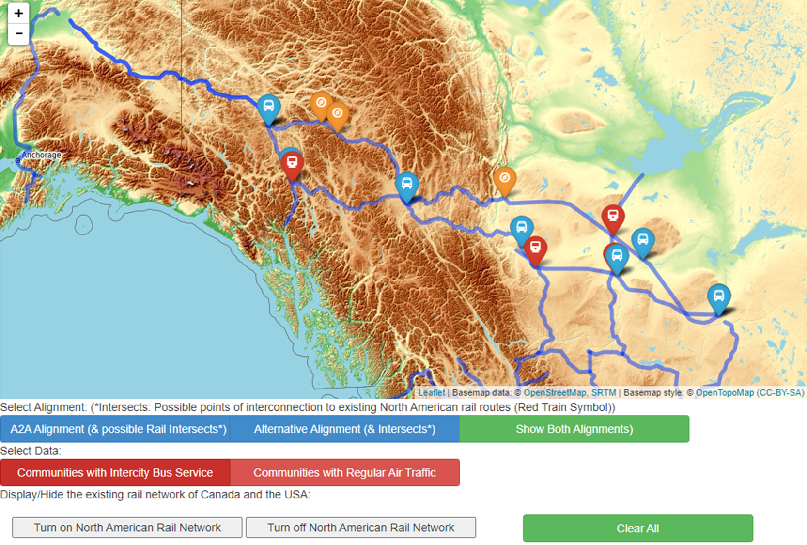

What is the Best Alignment for a Proposed Railway (both Passenger and Freight Rail) between Alberta and Alaska? 

https://ubc-geos472-spring2022.github.io/msinghhunjan-web/Lab2Web/index.html

In recent years, the idea of a railroad connection between Alberta and Alaska began to gather some momentum. Two Canadian groups, A2A rail 
and G7G Rail began to investigate the possibility of turning this dream into a reality. A2A rail went ahead and recieved many regulatory approvals and modified 
its proposed route alignment over time. The route alignment from Fort McMurray, Alberta and Watson Lake, Yukon changed from a more southernly connection through
Fort Nelson, BC, to a northernly connection through Fort Liard, Northwest Territories. The primary commidity for which the project has gained interest is for its
ability to allow the shipping of oil from Alberta to the ports of Alaska. While this aspect has been focused on primarily, other potential uses of the line such as
passenger rail didn't seem to get too much attention. Potential passenger rail service could offer an alternative to the Alaska Marine Highway system linking Washington
with Alaska with a network of ferries. Is the alignment proposed by A2A Rail more suitable for any passenger services? Are there communities on this route which can
handle an increased inflow of travelers? Are there ways for a traveler to explore a bit more and perhaps return home through a means of transport other than a train?

In this map, we look at A2A Rail's proposed alignment and a roughly similar alignment traversing a more southernly route. Dealing with the Data was certainly not easy.
I initially tried to create a GeoJSON file using the National Railway Network - NRWN data, but that did not work since the file was too big. So instead, I used a dataset
showing railways in North America and some in Europe but at a much lower resolution and level of detail than the NRWN data. Nonetheless, the data is great for
the puroposes of visualization at our map's display scale. The A2A data and the alternative alignment were things I mapped myself using the My Maps feature in Google Maps.
From there, I exported the data to Google Earth, adjusted my lines and points a bit more and exported a .kml file for editing in geojson.io. In geojson.io, I merged
the railroad dataset with my .kml file and created a new GeoJSON file for our use in this lab.

Primarily making use of leaflet and coding in p5.js, I designed a map which appropriately filters the data from our GeoJSON file (hosted online) to show A2A Rail's
proposed alignment as a line strecthing from Alberta into Alaska. The orange markers were used to show communities en-route of the proposed alignment. 
I was initally planning to use black markers but they seemed somewhat visually distracting. In the process of troubleshooting to figure out why any of the points 
on my map don't display any information in popups, the markers were left as is. Unfortunately, I wasn't able to figure out the issue and had to submit the lab. 

The "Alternative Alignment" button filters the alternative route and displays that instead of the A2A alignment. The red train symbol markers indicate points of
intersection with the existing North American Rail Network. The North American Rail Netork (limited to the rail netork of Canada/USA for our map) can be turned on/off
with the buttons beside the "Clear All" button on the lower right. This feature allows us to better see which rail lines intersect with either alignments. 

The "Select Data" buttons (Communities with Intercity Bus Service and Communities with Regular Air Traffic) filter and display relevant points on an alignment. If we 
do not select an alignment (after clicking "Clear All") the alignment displayed, is the southern one which has the largest number of communities offering some form
of intercity road transport or have airports served by regular flights. 

Overall this map aims to highlight which possible route alignment may offer the best stops/layover points for any potential passenger rail service and show points of
interconnection with other rail routes in North America.

I would've liked for my map to display community names and data from the individual markers. For some reason, that broke and I wasn't able to get it to work again.
It also would've been best if the lines of the exisiting NA rail, and the 2 alignments could've displayed in different colours. I initally wanted to use text boxes,
but removed and replaced them with buttons when elements on my map were starting to break. The map was a lot simpler than what I initally had in mind, but hopefully 
I can learn of what went wrong in the process and what could've been done to make my map better.

Collaboration: I did not collaborate with anyone on this lab!
